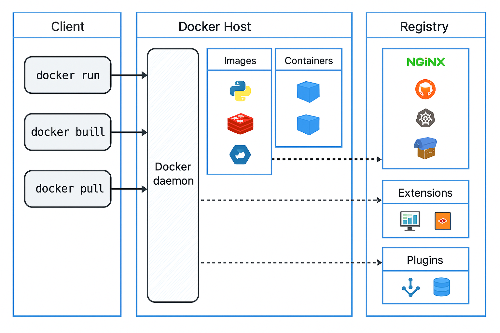

# 🐳 Docker Architecture Overview

---

## 📌 Overview

Docker is a platform that enables developers to package applications into containers—standardized executable components combining application source code with the operating system libraries and dependencies required to run that code in any environment.

This architecture includes three major components:

- **Client**
- **Docker Host**
- **Registry**

---

## 🧑‍💻 Client

The Docker **Client** is the interface used to interact with Docker. Most Docker users interact with the Docker daemon through the client.

### 🛠️ Common Commands

- `docker run`: Run a container from an image.
- `docker build`: Build an image from a Dockerfile.
- `docker pull`: Pull an image from a registry.

These commands are sent to the Docker daemon using Docker's REST API.

---

## 🖥️ Docker Host

The **Docker Host** is where the Docker daemon (`dockerd`) runs. It is responsible for building, running, and managing containers and images.

### 🔹 Docker Daemon

The core Docker service that manages:
- Containers
- Images
- Networks
- Volumes

### 🔹 Images

Docker **Images** are read-only templates used to create containers. They include everything needed to run an application.

**Examples:**
- Python
- Redis
- Alpine Linux

### 🔹 Containers

Containers are runtime instances of images. They run isolated from each other and the host machine, providing a lightweight, portable, and self-sufficient environment.

---

## 📦 Registry

A **Registry** is a repository for Docker images. The default registry is **Docker Hub**, but you can use private registries as well.

### 🔹 Components

- **Images**: Like NGINX, GitLab, Kubernetes, and Helm.
- **Extensions**: Add-ons to improve Docker's functionality (e.g., dashboards).
- **Plugins**: Extend Docker capabilities (e.g., networking, volumes).

### 🔄 Docker Daemon Interaction

The Docker daemon:
- Pulls images from the registry using `docker pull`
- Pushes images to the registry using `docker push`

---

## 🔄 How It All Works Together (Example)

1. You run `docker run python` from the client.
2. The Docker daemon checks if the Python image is available locally.
3. If not, it pulls the image from the registry.
4. The daemon then creates and runs a container using that image.

---

## ✅ Summary of Interactions

| From     | To           | Purpose                            |
|----------|--------------|------------------------------------|
| Client   | Docker Daemon| Sends commands (`run`, `build`)    |
| Daemon   | Registry     | Pulls/pushes images and metadata   |
| Daemon   | Images       | Stores and manages image layers    |
| Daemon   | Containers   | Runs isolated environments         |
